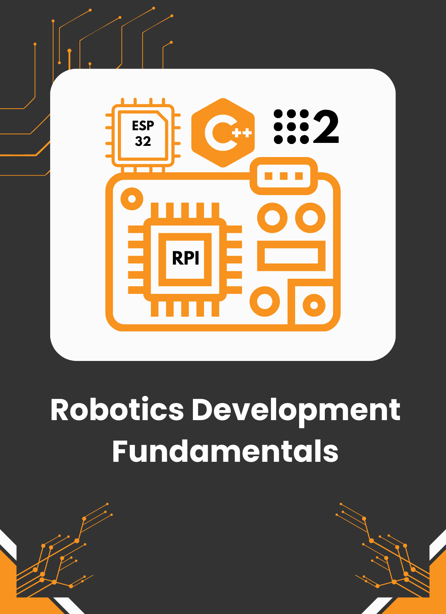

# Robotics Dev Fundamentals
#### Course Overview
- **Duration**: 12-15 hours
- **Target Audience**: Complete beginners interested in robotics programming, no prior experience required.
- **Goal**: Provide a free, accessible introduction to robotics development, covering Ubuntu setup, CLI basics, C++ programming, ROS2 fundamentals, and hardware integration with Raspberry Pi and ESP32 using micro-ROS.
- **Outcome**: Learners gain the skills to set up a robotics development environment, write basic C++ code, use ROS2 for communication, and connect an ESP32 to a Raspberry Pi for simple robot control.
- **Delivery**: Free online video lessons, with optional practice tasks listed at the end of each module (no submissions or grading).

#### Concepts Progression
1. **Environment Setup**: Installing Ubuntu and mastering basic CLI commands → Readying the system for robotics.
2. **C++ Basics**: Syntax, variables, and conditionals → Writing simple robotics-inspired code.
3. **C++ Organization**: Classes and CMake → Structuring code for scalability.
4. **ROS2 Introduction**: Installation and node creation → Running a basic robotics communication system.
5. **ROS2 Communication**: Topics and TurtleSim → Controlling a virtual robot.
6. **Raspberry Pi Integration**: ROS2 on RPi → Setting up a robotics hub.
7. **ESP32 Micro-ROS**: Hardware control with micro-ROS → Bridging ROS2 to physical devices.

----

### Contact Us
For any inquiries, feel free to reach out at `info@robotisim.com`

### Packages
- **Packages** (in recommended learning order)
    - `cpp_fundamentals` - C++ Programming Fundamentals
    - `drive_mobile_robot` - Mobile Robot Navigation Implementation
    - 'slambot_pio' - Platform io ESP32 interface source code

## License
This work is licensed under a Creative Commons Attribution-NonCommercial 4.0 International License. This license allows others to remix, tweak, and build upon the work non-commercially, as long as they credit the owner (robotisim) and license their new creations under the identical terms.

For more information, please visit [Creative Commons License](http://creativecommons.org/licenses/by-nc/4.0/).

---

 2025 robotisim. All rights reserved.
